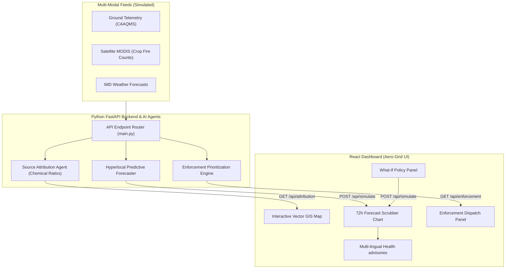

# Aero-Grid AI: Urban Air Quality Intelligence & Smart City Intervention Platform

Aero-Grid AI is a full-stack smart city control room prototype designed for municipal and environmental enforcement authorities in the **Delhi National Capital Region (NCR)**. 

Moving beyond standard "monitoring-only" dashboards, this platform acts as an **intelligence layer** that fuses multi-modal simulated feeds (CAAQMS ground sensors, meteorological forecasts, and remote sensing thermal crop burning anomalies) to deliver **geospatial source attribution**, **hyperlocal predictive forecasting**, and **automated enforcement prioritization**.

---

## 🛠️ Technology Stack

- **Frontend**: React 19 (TypeScript), Vite (Build tool & Bundler), Lucide React (Icons).
- **Styling**: Vanilla CSS with CSS Custom Variables (Design tokens, glassmorphic layout, glowing border states, and custom keyframe animations for wind dispersion overlays).
- **Backend**: Python 3.10+, FastAPI (Asynchronous REST API Router), NumPy (Emissions dispersion & source attribution matrix calculations).
- **Deployment & Containerization**: Multi-stage Dockerfile optimized for single-container hosting on **Hugging Face Spaces**.

---

## 📊 System Architecture



---

## 🌟 Core Features

1. **Geospatial Pollution Source Attribution**: 
   Fuses wind vectors and receptor chemical signatures to estimate the percentage contribution of:
   - *Vehicular Exhaust* (traffic peak cycles)
   - *Industrial Stacks* (boiler and fuel stack emissions)
   - *Crop Residue Burning* (NW wind-carried agricultural smoke plumes)
   - *Road & Construction Dust* (coarse mechanical dust)
2. **72-Hour Hyperlocal Forecasting**: 
   Predicts AQI levels at ward resolution, simulating diurnal traffic variations and winter boundary-layer thermal inversions (where cool, stagnant air traps particulate matter).
3. **What-If Policy Sandbox**: 
   Allows administrators to simulate the impact of municipal policy interventions in real-time. Sliders and toggles control:
   - *Odd-Even Traffic rules* (reduces vehicle emissions)
   - *Stubble Burning Ban* (restricts biomass influx)
   - *GRAP Stage IV Construction Ban* (limits mechanical road dust)
   - *Smog Cannon Deployments* (reduces dust locally)
   - *Industrial Boiler output limits* (caps factory emissions)
   
   The forecast graph immediately compares the **Baseline Forecast** vs. the **Mitigated Forecast** line.
4. **Enforcement Dispatch Console**: 
   Flags active pollution anomalies at coordinates (e.g., Anand Vihar ISBT, Bawana Phase II) and generates prioritized enforcement cards with AI recommended actions (deploy smog cannons, inspect boilers) and dispatch trackers.
5. **Citizen Health Risk Advisory System**: 
   Broadcasts localized health warnings with vulnerable demographic protocols, supporting instant translation toggles for **English, Hindi, and Punjabi**.

---

## 🚀 How to Run Locally

### 1. Prerequisiets
Ensure you have `Node.js (v18+)` and `Python (v3.10+)` installed on your machine.

### 2. Setup and Start

Run the following commands in your terminal:

```bash
# 1. Clone or navigate to the project directory
cd aqi-intelligence

# 2. Build the React frontend
cd frontend
npm install
npm run build
cd ..

# 3. Create a python virtual environment and install requirements
python3 -m venv .venv
source .venv/bin/activate
pip install -r requirements.txt

# 4. Start the FastAPI server
uvicorn main:app --host 127.0.0.1 --port 7860
```

Open your browser and navigate to **[http://127.0.0.1:7860](http://127.0.0.1:7860)**. The FastAPI backend serves the React frontend compiled static files directly from the same port.

---

## ☁️ Deploy to Hugging Face Spaces

1. Create a new Space on [Hugging Face](https://huggingface.co/new-space).
2. Choose **Docker** as the SDK.
3. Keep the template blank and set your Space's visibility.
4. Clone the Space's Git repository or upload the files directly to the Space's files section.
5. Upload the entire contents of the `aqi-intelligence` folder (including `Dockerfile`, `main.py`, `requirements.txt`, and the `frontend/` directory).
6. Hugging Face will automatically execute the multi-stage Docker build, compile the React bundle, launch the Python server, and host the live app under a public URL.

---

## 🤖 AI Usage Note

This prototype was developed collaboratively using the **Antigravity AI Coding Assistant**. 

### What We Accepted:
- **Python-based Math Models**: We accepted the use of NumPy-based dispersion equations to simulate real-world atmospheric chemistry, temperature inversions, and crop smoke dispersion, which aligns with scientific standards.
- **Custom Vector Graphics**: We accepted building a custom SVG vector map of Delhi NCR instead of importing heavy, internet-dependent libraries like Mapbox or Leaflet. This ensures zero API-key dependencies, zero load lag, and allows styling glowing custom CSS keyframe animations for wind vectors and crop fire smoke overlays.
- **TypeScript Type Safety**: We accepted structuring type interfaces before writing components to ensure bug-free integration.

### Where We Exercised Critical Judgment:
- **Single-Port Containerization**: While AI tools often suggest running a separate React dev server and Python backend (requiring CORS configuration and running multiple local commands), we engineered a **single-port multi-stage Docker deployment**. The FastAPI backend mounts the compiled React `dist/` directory at the root (`/`). This ensures zero CORS friction, a single start command for judges, and a one-click deployment pipeline for Hugging Face Spaces.
- **Verbatim Module Syntax**: Resolved Vite’s TypeScript compiler restrictions regarding module imports by using explicit `import type` definitions to satisfy production compilation requirements.
