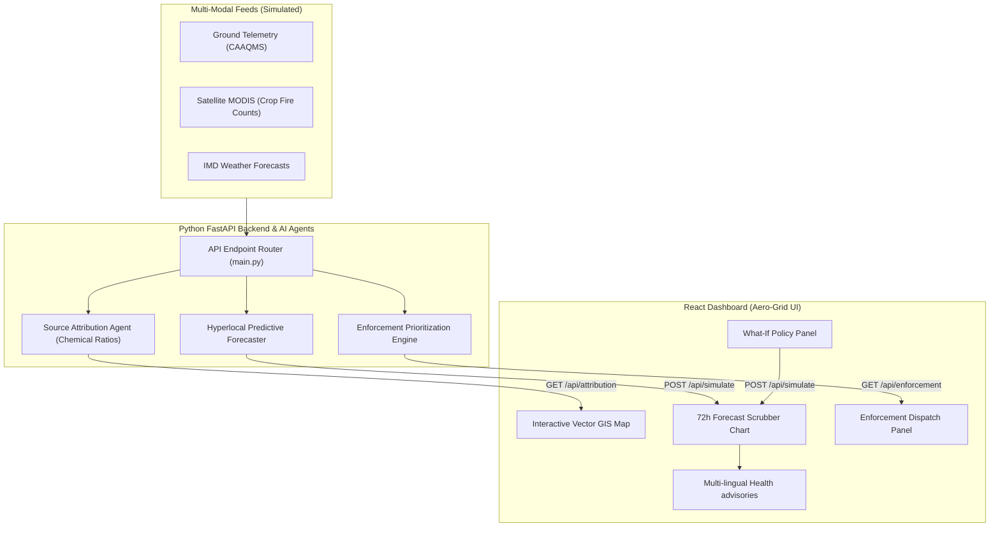
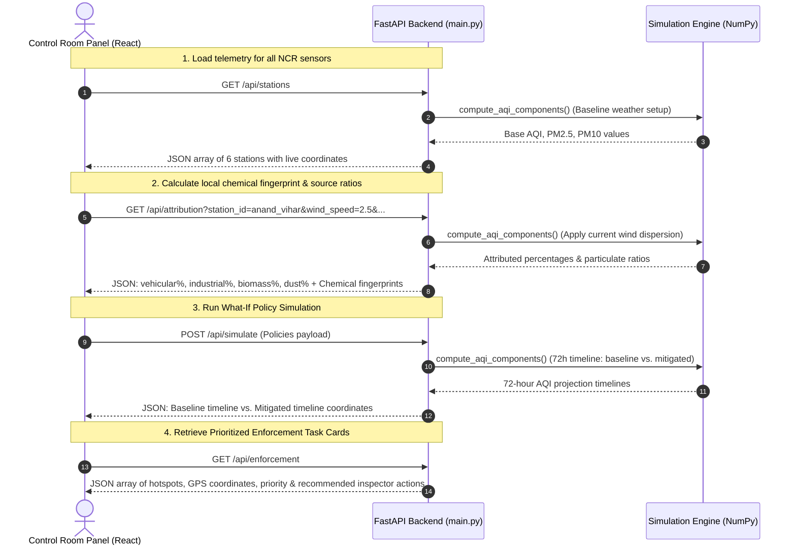

# Aero-Grid AI: Urban Air Quality Intelligence & Smart City Intervention Platform

Aero-Grid AI is a full-stack smart city control room designed to help city administrators move from **measuring** air pollution to **preventing** it. 

---

## 🏙️ Case Study: The Delhi NCR Air Quality Crisis

Delhi NCR faces one of the most complex air quality challenges in the world. While we have plenty of sensors capturing data, city administrations often struggle to act quickly because they lack an **intelligence layer** to translate readings into targeted solutions.

### What goes wrong with Delhi's air quality?
1. **Vehicular Congestion**: Millions of idling engines at major junctions (like ITO and Dhaula Kuan) create localized hubs of high nitrogen oxides ($NO_x$) and fine particulate matter ($PM_{2.5}$).
2. **Industrial Clusters**: Areas like Bawana house manufacturing units, boiler operations, and waste-incineration activities that emit sulfur dioxide ($SO_2$) and volatile compounds.
3. **Seasonal Crop Residue Burning**: During winter, agricultural burning in neighboring Punjab and Haryana releases massive plumes of smoke.
4. **Meteorological Trapping**: When wind speeds drop and winter thermal inversions occur, cool air gets trapped close to the ground like a lid on a pot, locking all these emissions over the city. When North-West winds blow, they carry the stubble smoke directly into the heart of Delhi.

Aero-Grid AI solves this by fusing live sensor data with weather patterns to tell administrators **where the pollution is coming from**, **what it will look like in 72 hours**, and **exactly where to send inspectors** to stop it.

---

## 📊 System Architecture



---

## 🌟 Key Features: What They Do & How They Help

### 1. Interactive GIS Vector Map
* **What it does**: Displays a stylized map of Delhi NCR's zones, showing live sensor stations (pins glow green, orange, or red based on AQI), animated wind flow vectors, and dynamic crop smoke plume overlays.
* **What problem it solves**: Traditional dashboards are just numbers and tables. They do not show how pollution spreads across the city.
* **How it helps**: Administrators can immediately see the physical shape of pollution, trace wind directions, and identify which wards are downwind of major polluters.

### 2. Geospatial Pollution Source Attribution
* **What it does**: Breaks down exactly what percentage of pollution is caused by traffic, industrial stacks, crop residue burning, or road/construction dust. It also checks "chemical fingerprints" (like $PM_{2.5}$ to $PM_{10}$ ratios) to verify the results.
* **What problem it solves**: When pollution spikes, leaders are often in the dark about who is responsible. They might issue blanket bans (like closing all construction or industries), which hurts the economy.
* **How it helps**: Allows targeted enforcement. If the AI shows that a spike is 70% construction dust, the city can deploy water sprinklers instead of shutting down local factories.

### 3. Hyperlocal Predictive Forecasting (72 Hours)
* **What it does**: Predicts AQI levels 3 days in advance by analyzing upcoming weather trends (wind speed, direction, mixing height) and traffic calendars.
* **What problem it solves**: Municipal action is currently reactive. City authorities only act *after* the air becomes unbreathable.
* **How it helps**: Gives administrators a 24-to-72 hour head start. If a stagnation zone is predicted for Tuesday, they can schedule interventions on Monday to prevent the spike from happening.

### 4. "What-If" Policy Sandbox
* **What it does**: A simulator with sliders and toggles where users can turn on policies (like the Odd-Even traffic rule, industrial scaling, or a construction ban) and instantly see the predicted drop in future AQI on a chart.
* **What problem it solves**: Environmental policies are often trial-and-error, making it hard to know if a policy will be effective before implementing it.
* **How it helps**: Lets leaders test strategies in a safe simulator first, allowing them to choose the most cost-effective and highest-impact policies.

### 5. Enforcement Dispatch Desk
* **What it does**: Generates prioritized inspection cards showing coordinates and recommended actions (such as deploying smog cannons, halting excavators, or checking factory scrubbers).
* **What problem it solves**: Fills the gap between detecting a hotspot and getting inspectors on the ground.
* **How it helps**: Speeds up response times by automatically routing municipal inspectors directly to the source of the emission anomaly.

### 6. Citizen Health Risk Advisory
* **What it does**: Translates warnings and safety guidelines into regional languages (**English, Hindi, and Punjabi**).
* **What problem it solves**: Health alerts are often generic, delayed, and do not account for language barriers or vulnerable populations (schools and hospitals).
* **How it helps**: Ensures that school principals, hospital staff, and elderly citizens get immediate, readable directives (like moving physical education classes indoors).

---

## ⚙️ Technical Workflow (How it Works)

Aero-Grid AI is built on a modular, lightweight architecture that connects user controls directly to physical dispersion equations:

```text
[ React Frontend (Vite) ]  <-- (JSON APIs) -->  [ FastAPI Backend (Python) ]
         │                                                 │
         ▼                                                 ▼
Renders GIS Map, Charts,                       Runs mathematical models
Sliders & Dispatch Cards                       using NumPy (Wind vectors, 
                                               chemical fingerprints)
```

1. **User Interface (React + TypeScript)**: Runs in the browser. When a user clicks a station on the map or adjusts a weather slider, the frontend sends a request to the backend.
2. **Server Router (FastAPI)**: Serves as the communication bridge. It receives the parameters, validates them, and passes them to the math models.
3. **Simulation Core (Python + NumPy)**: Performs calculations using dispersion math. It simulates how winds carry pollutants, how mixing heights trap smoke, and how policy reductions impact future AQI.
4. **Single-Container Assembly (Docker)**: The frontend is compiled into static HTML/CSS files, which are hosted directly by the Python server. The entire app is packaged into a single container that runs on port `7860`.

---

## 📡 API Communication Flow

The React frontend communicates with the FastAPI simulation server using four main REST endpoints:



---

## 🚀 How to Run Locally

### 1. Build the Frontend
Navigate to the `frontend` folder, install the packages, and compile the assets:
```bash
cd aqi-intelligence/frontend
npm install
npm run build
cd ..
```

### 2. Start the Server
Create a virtual environment, install the dependencies, and run the server:
```bash
# Set up Python environment
python3 -m venv .venv
source .venv/bin/activate
pip install -r requirements.txt

# Run the FastAPI server
uvicorn main:app --host 127.0.0.1 --port 7860
```
Open **[http://127.0.0.1:7860](http://127.0.0.1:7860)** in your browser. The server will run the APIs and serve the compiled React dashboard at the same address.
