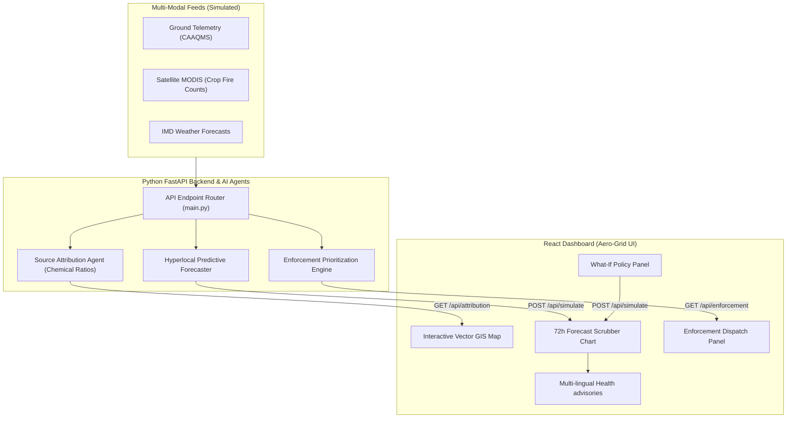
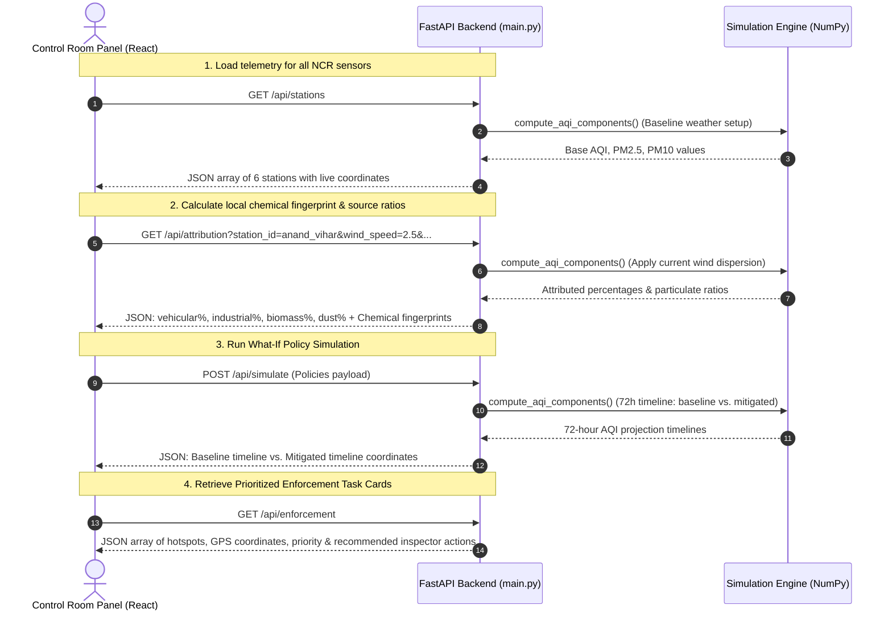

# Aero-Grid AI: Urban Air Quality Intelligence & Smart City Intervention Platform

Aero-Grid AI is a full-stack smart city control room prototype designed for municipal and environmental enforcement authorities in the **Delhi National Capital Region (NCR)**. 

Moving beyond standard "monitoring-only" dashboards, this platform acts as an **intelligence layer** that fuses multi-modal simulated feeds (CAAQMS ground sensors, meteorological forecasts, and remote sensing thermal crop burning anomalies) to deliver **geospatial source attribution**, **hyperlocal predictive forecasting**, and **automated enforcement prioritization**.

---

## 🛠️ Technology Stack

- **Frontend**: React 19 (TypeScript), Vite (Build tool & Bundler), Lucide React (Icons).
- **Styling**: Vanilla CSS with CSS Custom Variables (Design tokens, glassmorphic layout, glowing border states, and custom keyframe animations for wind dispersion overlays).
- **Backend**: Python 3.10+, FastAPI (Asynchronous REST API Router), NumPy (Emissions dispersion & source attribution matrix calculations).
- **Deployment & Containerization**: Multi-stage Dockerfile optimized for single-container hosting on **Hugging Face Spaces**.

---

## 📊 System Architecture



---

## 📡 API Endpoints & Communication Flow

The React frontend communicates with the FastAPI simulation server using four main REST endpoints:



### API Endpoint Contracts

#### 1. `GET /api/stations`
- **Description**: Returns all 6 Delhi NCR monitoring stations with metadata and current weather-adjusted AQI.
- **Response Shape**:
  ```json
  [
    {
      "id": "anand_vihar",
      "name": "Anand Vihar",
      "lat": 28.6476,
      "lon": 77.3158,
      "zone": "East Delhi",
      "telemetry": { "aqi": 345.2, "pm25": 210.5, "pm10": 320.1, "traffic": 85.0, "industry": 35.0, "biomass": 28.0, "dust": 74.0 },
      "weather": { "wind_speed": 2.5, "wind_direction": 300.0, "mixing_height": 450.0, "active_fires": 850 }
    }
  ]
  ```

#### 2. `GET /api/attribution`
- **Description**: Analyzes local weather dispersion matrices to determine source categories.
- **Parameters**: `station_id` (string), `wind_speed` (float), `wind_direction` (float), `mixing_height` (float), `active_fires` (int)
- **Response Shape**:
  ```json
  {
    "station_id": "anand_vihar",
    "confidence_score": 93.5,
    "source_breakdown": {
      "Vehicular Exhaust": 32.1,
      "Industrial Stacks": 12.4,
      "Crop Residue Burning": 25.5,
      "Road & Construction Dust": 30.0
    },
    "fingerprints": {
      "PM2.5_PM10_Ratio": 0.66,
      "SO2_NOx_Ratio": 0.22,
      "CO_NO2_Ratio": 9.15
    }
  }
  ```

#### 3. `POST /api/simulate`
- **Description**: Computes predicted 72-hour AQI timelines comparing normal conditions (baseline) vs active policy interventions.
- **Request Body**:
  ```json
  {
    "station_id": "anand_vihar",
    "forecast_hours": 72,
    "policies": {
      "odd_even": true,
      "stubble_ban": false,
      "smog_cannons": true,
      "factory_scaling": 75.0,
      "construction_ban": true
    }
  }
  ```
- **Response Shape**:
  ```json
  {
    "station_id": "anand_vihar",
    "baseline": [
      { "hour": 0, "aqi": 320, "pm25": 190, "pm10": 280, "wind_speed": 3.5, "wind_direction": 295.0, "mixing_height": 600.0 }
    ],
    "mitigated": [
      { "hour": 0, "aqi": 220, "pm25": 110, "pm10": 170, "wind_speed": 3.5, "wind_direction": 295.0, "mixing_height": 600.0 }
    ]
  }
  ```

#### 4. `GET /api/enforcement`
- **Description**: Evaluates active hotspots and spits out prioritised inspection guidelines.
- **Response Shape**:
  ```json
  [
    {
      "id": "ENF-001",
      "station_id": "anand_vihar",
      "zone": "Anand Vihar (ISBT Corridor)",
      "priority": "CRITICAL",
      "reason": "PM10 levels exceeding 420 ug/m3. Wind speed stagnant (< 1.2 m/s).",
      "source_category": "Road & Construction Dust",
      "recommended_actions": [
        "Deploy 4 High-Capacity Smog Cannons immediately.",
        "Execute mechanical water-sprinkling along the highway corridor."
      ],
      "gps": { "lat": 28.6480, "lon": 77.3162 },
      "status": "PENDING"
    }
  ]
  ```

---

## 🌟 Core Features

1. **Geospatial Pollution Source Attribution**: 
   Fuses wind vectors and receptor chemical signatures to estimate the percentage contribution of vehicular exhaust, industrial stack emissions, biomass burning, and road/construction dust.
2. **72-Hour Hyperlocal Forecasting**: 
   Predicts AQI levels at ward resolution, simulating diurnal traffic variations and winter boundary-layer thermal inversions (where cool, stagnant air traps particulate matter).
3. **What-If Policy Sandbox**: 
   Allows administrators to simulate the impact of municipal policy interventions in real-time, plotting Baseline vs. Mitigated forecast curves.
4. **Enforcement Dispatch Console**: 
   Flags active pollution anomalies at coordinates (e.g., Anand Vihar ISBT, Bawana Phase II) and generates prioritized enforcement cards with AI recommended actions.
5. **Citizen Health Risk Advisory System**: 
   Broadcasts localized health warnings with vulnerable demographic protocols, supporting instant translation toggles for **English, Hindi, and Punjabi**.

---

## 🚀 How to Run Locally

### 1. Prerequisites
Ensure you have `Node.js (v18+)` and `Python (v3.10+)` installed on your machine.

### 2. Setup and Start

Run the following commands in your terminal:

```bash
# 1. Clone or navigate to the project directory
cd aqi-intelligence

# 2. Build the React frontend
cd frontend
npm install
npm run build
cd ..

# 3. Create a python virtual environment and install requirements
python3 -m venv .venv
source .venv/bin/activate
pip install -r requirements.txt

# 4. Start the FastAPI server
uvicorn main:app --host 127.0.0.1 --port 7860
```

Open your browser and navigate to **[http://127.0.0.1:7860](http://127.0.0.1:7860)**. The FastAPI backend serves the React frontend compiled static files directly from the same port.

---

## ☁️ Deploy to Hugging Face Spaces

1. Create a new Space on [Hugging Face](https://huggingface.co/new-space).
2. Choose **Docker** as the SDK.
3. Keep the template blank.
4. Upload the entire contents of the `aqi-intelligence` folder (including `Dockerfile`, `main.py`, `requirements.txt`, and the `frontend/` directory).
5. Hugging Face will automatically execute the multi-stage Docker build, compile the React bundle, launch the Python server, and host the live app under a public URL.

---

## 🤖 AI Usage Note

This prototype was developed collaboratively using the **Antigravity AI Coding Assistant**. 

### What We Accepted:
- **Python-based Math Models**: We accepted the use of NumPy-based dispersion equations to simulate real-world atmospheric chemistry, temperature inversions, and crop smoke dispersion, which aligns with scientific standards.
- **Custom Vector Graphics**: We accepted building a custom SVG vector map of Delhi NCR instead of importing heavy, internet-dependent libraries like Mapbox or Leaflet. This ensures zero API-key dependencies, zero load lag, and allows styling glowing custom CSS keyframe animations for wind vectors and crop fire smoke overlays.
- **TypeScript Type Safety**: We accepted structuring type interfaces before writing components to ensure bug-free integration.

### Where We Exercised Critical Judgment:
- **Single-Port Containerization**: While AI tools often suggest running a separate React dev server and Python backend (requiring CORS configuration and running multiple local commands), we engineered a **single-port multi-stage Docker deployment**. The FastAPI backend mounts the compiled React `dist/` directory at the root (`/`). This ensures zero CORS friction, a single start command for judges, and a one-click deployment pipeline for Hugging Face Spaces.
- **Verbatim Module Syntax**: Resolved Vite’s TypeScript compiler restrictions regarding module imports by using explicit `import type` definitions to satisfy production compilation requirements.
